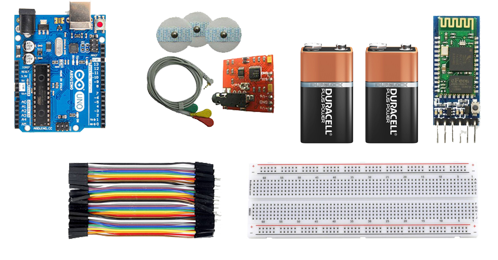
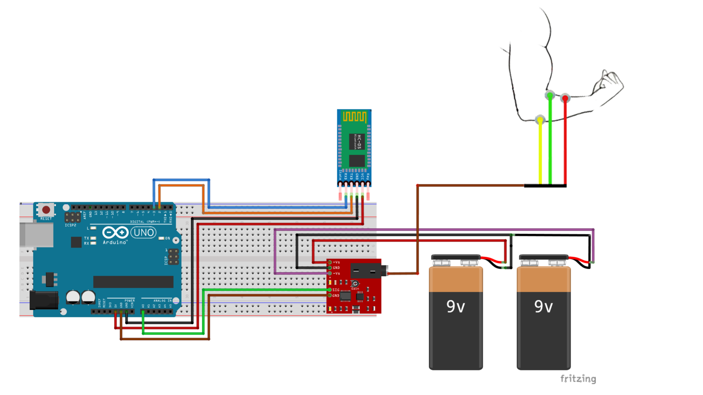

# AndroMyography

<p align="center">
  
</p>

## Table of contents
* [General info](#general-info)
* [Hardwares](#hardwares)
* [Technologies](#technologies)
* [Project Guide](#project-guide)

## General info
This application is used to view the patient's nerve and muscles signals.        
And the sensor data is sent to the mobile phone via Bluetooth and its chart is plotting in the application.

## Hardwares
* Arduino UNO
* EMG Module
* Bluetooth Module HC-05
* Breadboard
* 9v Battry
* Jumper Wire

<p align="center">
  
</p>

## Technologies
Project is created with:
* Kotlin
* Realm DataBase
* MPAndroidChart
* EventBus 3.3.1

## Project Guide
Upload the following code to the Arduino :
```
#include <SoftwareSerial.h>
SoftwareSerial bluetooth(2 , 3); // RX|TX

int sensorPin = A0;
int sensorData = 0;

void setup() {
  pinMode(sensorPin , INPUT);
  Serial.begin(9600);
  bluetooth.begin(9600);

}

void loop() {
  
  // read the value from analog inpute
  sensorData = analogRead(sensorPin);
  bluetooth.print(sensorData);
  delay(1000);

}
```
Assemble your circuit according to the diagram below :
<p align="center">
  
</p>

Then run the App and click Add New Patient.            
After entering the patient details completely,click on the submit information          
and then click on the desired Bluetooth from the list of known Bluetooth.         
Click on the start botton when entering the analysis page.

